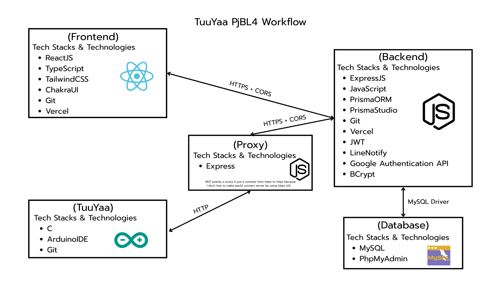
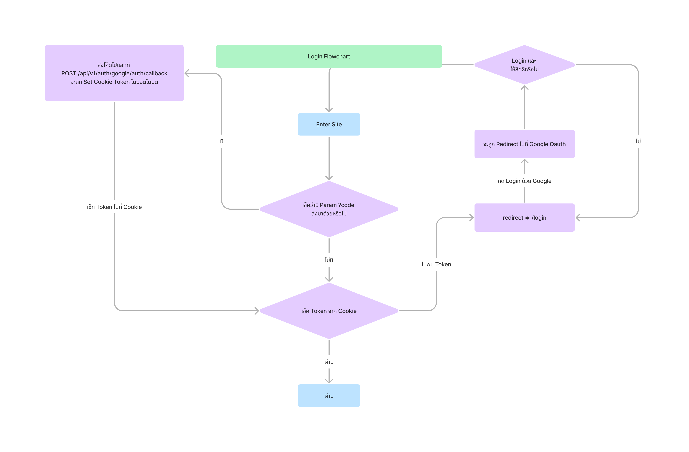
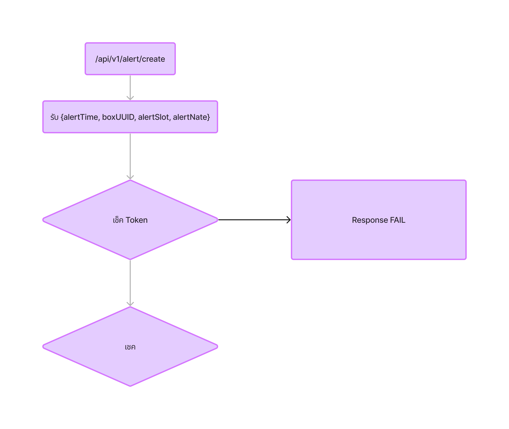
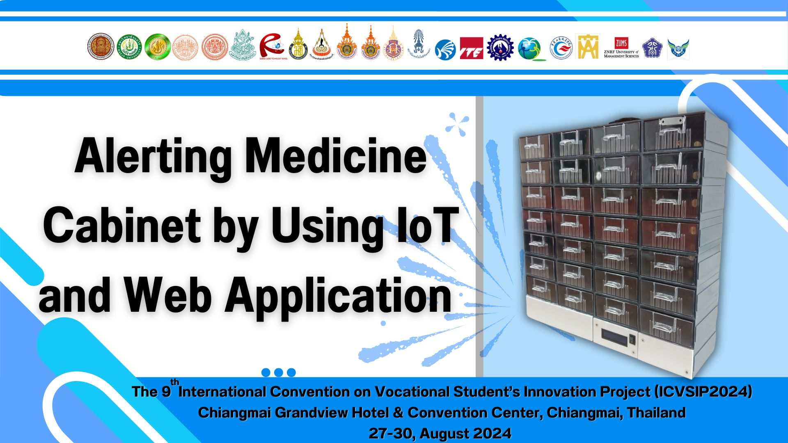

<br />
<div align="center">
    
    
    
</div>

<br />

<br />

<h1 align="center">Alerting Medicine Cabinet by Using IoT and Web Application</h1>
<h3 align="center">ตู้ยาเเจ้งเตือนด้วยเทคโนโลยีไอโอที</h3>

<p>&nbsp&nbsp&nbsp&nbsp&nbsp&nbsp&nbsp&nbsp&nbsp Project PjBL ชิ้นที่ 4 โดยชิ้นนี้ได้นำไปประกวนที่งานนานาชาติที่จะมีฐานวิทย์ทุกภาคมาร่วมประกวดผลงานกันเเละเเน่นอนต่างชาติอีกหลายๆ ประเทศเช่น จีน ญี่ปุ่น เกาหลี สิงคโปร์ เเละ บังกลาเทศ โปรเจคชิ้นนี้มีคอนเซบว่า ผู้ป่วยที่เป็นผู้สูงอายุมักจะมีพฤติกรรมที่หลงๆ ลืมๆ ในบางครั้งทำให้พลาดการทานยาในมืออาหารนั้นไป ทำให้ลูกๆ หรือ ผู้ดูเเลผู้ป่วยท่านนั้นอาจจะรุ้สึกไม่สบายใจหากต้องปล่อยให้ผู้ป่วยนั้นอยู่ตามลำพังเพราะมีภาระอย่างอื่นที่ต้องทำ จึงได้เป็นที่มาของโปรเจคนี้จะมีการทำงานอยู่ว่า...</p>

```
1 ผู้ดูเเลผู้ป่วยตั้งเวลาบนแอพพลิเคชั้น(Web) โดยจะสามารถตั้งเวลาได้ทั้งหมด 7 วันหรือภายในสัปดาห์หนึ่ง ภายใน 1 วันสามารถตั้งมื้อที่ต้องทานได้ 4 มื้อ คือ เช้า กลางวัน เย็น เเละก่อนนอน เเละในเเต่ละมื้อสามารถตั้งก่อนอาหารหรือหลังอาหารได้

2 เมื่อตู้ยาตรวจสอบเวลาการเเจ้งเตือนพบจะส่งสัญญาน 3 เเบบคือ เสียง ไฟที่ช่องยาที่ต้องทาน เเละ LINE Notify ที่จะส่งให้ผู้ดูเเล

3 ตัวผู้ป่วยจะต้องไปรับยาที่ช่องที่ไฟ LED ได้เเสดงขึ้น หากไม้เปิดเเละปิดช่องนั้นสัญญานจะไม่หยุดเเจ้งเตือน

4 หากผู้ป้วยได้ทานยาเรียบร้อย ให้ปิดช่องยาเเละสัญญานจะหยุดเเจ้งเตือน

5 LINE Notify จะเเจ้งสถานะว่าผู้ป่วยได้ทานยาในเวลานั้นเเล้ว เเละทำการเช็คเวลาเเจ้งเตือนถัดไป
```

<h2>คณะผู้จัดทำ (หลัก)</h2>
<ol>
    <li>
        <p>นส. สภัสลดา ไชยจักร (ชมพู) 🐕</p>
    </li>
    <li>
        <p>นาย คณกร ไทยประโคน (ณณฑ์) 😎</p>
    </li>
    <li>
        <p>นาย ธนานพ ยศฐาศักดิ์ (นพ) 🤓</p>
    </li>
    <li>
        <p>นาย ยศกร อังคะนาวิน (ชิ) 🐖</p>
    </li>
</ol>

<h2>Stacks (Languages & Frameworks)</h2>
<ol>
    <li>
        <p>ReactJS</p>
    </li>
    <li>
        <p>Vite</p>
    </li>
    <li>
        <p>TailwindCSS</p>
    </li>
    <li>
        <p>ChakraUI</p>
    </li>
    <li>
        <p>TypeScript</p>
    </li>
    <li>
        <p>ExpressJS</p>
    </li>
    <li>
        <p>Prisma</p>
    </li>
    <li>
        <p>JavaScript</p>
    </li>
    <li>
        <p>MySQL</p>
    </li>
    <li>
        <p>SQL</p>
    </li>
    <li>
        <p>Arduino</p>
    </li>
    <li>
        <p>C language</p>
    </li>
</ol>

<h2>Host & Database</h2>
<ol>
    <li>
        <p>App ใช้ <a href="https://vercel.com/" target="_blank">Vercel</a></p>
    </li>
    <li>
        <p>Database (MySQL) ใช้ <a href="https://www.hostatom.com/" target="_blank">HostAtom</a></p>
    </li>
    <li>
        <p>VPS (Proxy) ใช้ <a href="https://sun-vps.com/" target="_blank">SunVPS</a></p>
    </li>
</ol>

<h2>Workflow</h2>


<h2>API Design</h2>


<h2>Google Authentication Design</h2>


<h2>Example for Authentication method for Each API</h2>


<h2>Requirements</h2>
<ul>
    <li>
        <p>node v.20.18.x</p>
    </li>
    <li>
        <p>npm v.10.9.x</p>
    </li>
    <li>
        <p>npx v.10.9.x</p>
    </li>
    <li>
        <p>yarn v.1.22.x</p>
    </li>
    <li>
        <p>tsx หรือ ts-node สำหรัน Run ไฟล์ .ts  </p>
    </li>
    <li>
        <p>GIT</p>
    </li>
</ul>

<h2>Installation Methods</h2>
<ol>
    <li>
        <p>เดี๋ยวมาเขียน ขก.</p>
    </li>
</ol>

<h2>⛔ Warning ⛔</h2>
<p>จำไม่ได้ล่ะ เเต่ล่ะอย่าง เเต่ที่รู้ๆ คือบัคเยอะมากกกกกๆ เเบบมากกกกกอ่ะ โค้ดก็โคตรเน่าเเต่ละตัว คือตอนนั้นเหลือเวลาเดือนนึงมั้งกับอีกครึ่งก็เลยบัคไหนมันหลบๆ ได้ก็ไม่ได้เเก้ 55555 API บางเส้นก็ยังทำไม่เสร็จเลยด้วยซ้ำ 55555 อย่าว่าเเต่ API เลย Frontend บางหน้าเเม่งยังโล่งๆ อยู่เลยด้วยซ้ำ LMAO ┏ (゜ω゜)=👍 </p>


<h2>Presentation</h2>
<a href="https://www.canva.com/design/DAGOih-OMlk/Iim0tcMWnl6m0vH6AOjpBg/edit?utm_content=DAGOih-OMlk&utm_campaign=designshare&utm_medium=link2&utm_source=sharebutton" target="_blank">
    
</a>

<hr />
<h3 align="center">Made with 💗 by The Greatest Developer That's Ever Live </h3>